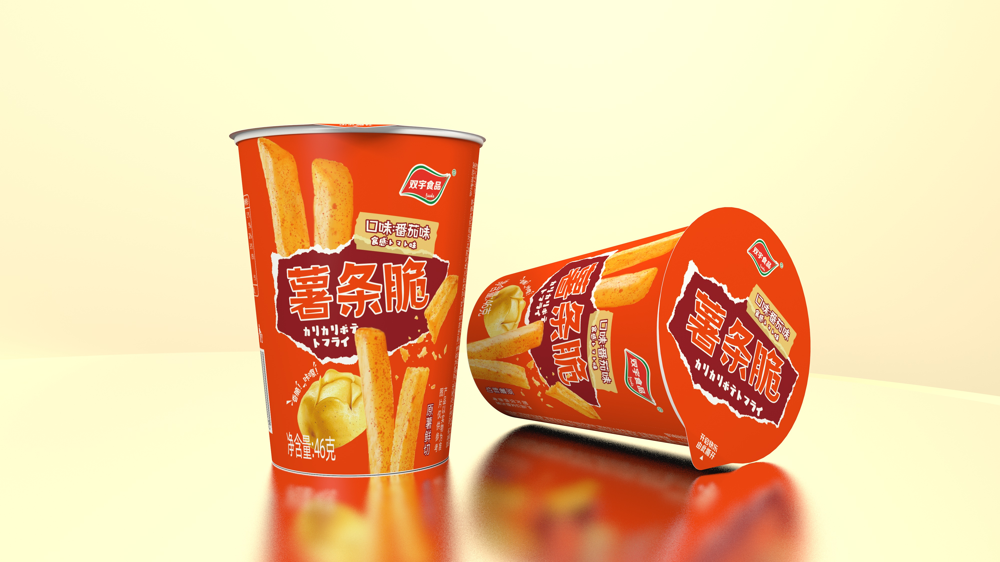

# 00 · Brief 与解读

> 阶段 0 · 立项 ｜ 2026-08-05

## 客户原话

> 「做两支广告。」

加一张产品图。工艺方面客户明确说了是 **VF（真空低温油炸）**。

**除此之外没有别的信息。** 渠道、时长、预算、交期、投放目的全部未定，由我方提案。

::: warning 这是最典型的一种开局
不是信息不足，是**客户自己也还没想清楚**。这种情况下提案的第一价值不是创意，是**把问题结构化地摆出来让客户做选择**——他做完选择，brief 就有了。
:::

## 产品图

## 从图上能确认的事实

| 项 | 内容 |
|---|---|
| 品牌 | 双宇食品（绿色盾形 logo，带 ® 注册标） |
| 产品名 | 薯条脆 |
| 口味 | 番茄味 |
| 规格 | **净含量 46 克** |
| 包装形态 | **纸杯装** + 铝箔封口 + 可复盖的塑料圆盖 |
| 包装文案 | 「原薯鲜切」（侧面）、「开启畅乐 由此撕开」（盖顶） |
| 日文副标 | カリカリポテトフライ（脆脆薯条） |
| 主视觉 | 高饱和橙底 + 深红撕纸块 + 白色主标字，图上有薯条与土豆的实物图 |

::: danger 这张图是渲染图，不是实拍
干净的渐变背景、完美的表面反射、无任何瑕疵——这是 3D 渲染或高度精修的效果图。

**影响很直接**：成片里包装出镜必须用实拍或设计源文件，[选型决策树 A1](/tools/decision-tree#a1-产品必须精确还原吗) 已经写死了这一条。而我们现在手上既没有实拍，也没有源文件，**只有一张不知道能不能商用的渲染图**。

这是物料清单的第一优先级。
:::

## 我们的解读

### ① 卖点冲突：客户想讲 VF，包装上主打「原薯鲜切」

**包装通篇没有出现「VF」「真空」「低温油炸」任何一个字。** 主打的是「原薯鲜切」。

这两个是**不同层面的卖点**：

| | 说的是什么 | 对立面是什么 |
|---|---|---|
| **原薯鲜切** | 原料形态——真土豆切的 | 薯粉压模成型（复合薯片） |
| **VF 工艺** | 加工方式——真空低温油炸 | 常压高温油炸 |

片子讲一个包装上不存在的概念，消费者拿到手对不上，反而伤信任。这条必须在提案里给客户一个说法。

### ② 46g 杯装，不是袋装

杯装带来的差异，全都是袋装没有的：

| | 意味着什么 |
|---|---|
| 有开盖动作 | **撕铝箔封口**是一个干净、有声音、有仪式感的动作——袋装的「撕开」远没这么好看 |
| 可复盖 | 「吃不完盖上」是一个真实使用场景 |
| 46g 单人份 | 即食装，指向便利店 / 零食集合店 / 办公室场景，**不一定以电商详情页为主** |
| 杯身可立 | 桌面场景、分享场景成立 |

### ③ 日文元素：定性未明，是风险不是资产 <Badge type="tip" text="2026-08-06 已定性" />

副标「カリカリポテトフライ」是日文。

::: danger 这条不能自己猜
- 如果产品**真有日本背景**（日本技术、日方合作、出口日本），日式调性可以做，且是好资产。
- 如果只是**视觉风格上的借用**，那么片子里做日式调性、出现日本场景或暗示进口，**属于虚假宣传**。

包装上印日文本身是行业常见做法，法律上通常不构成问题；但**广告是另一回事**——广告里主动暗示「这是日本的」，性质完全不同。

**这条直接进物料清单，不自己判断。**
:::

::: tip 2026-08-06 已定性：纯装饰
客户明确答复——**日文副标只是装饰，与日本无任何技术、合作或出口关系。**

处理方式不变（片中不出现日式元素），但这条从「风险」变成了「已知条件」。

**而作为已知条件，它比作为风险时更有用**：既然日文没有任何实质支撑，它在包装上就只剩借力效果——**指向的还是别人的心智**。由此新增一条执行约束：包装出镜时不刻意突出日文副标。完整推理见 [项目首页决议 ③](./#③-日文元素-定性前一律不碰)。

上面那段「不能自己猜」的原文保留不动。**当时不猜是对的**——如果当时按「视觉借用」自行判断并据此做了日式调性，现在拿到的答案会证明那是虚假宣传；如果按「可能有背景」保守处理，又会白白绕路。**答案是哪个都不重要，重要的是当时没有资格猜。**
:::

## 客户补充物料 · VF 工艺资料

> 2026-08-06 ｜ 客户以文字形式提供，无附件、无出处标注

### 原文

> **VF —— 真空低温脱水技术（又称低温油浴技术）**
>
> VF 技术多用于果蔬脆片生产。该技术融合真空技术与油炸脱水原理：在负压低温环境下，以热油作为传热介质，让果蔬内部水分快速蒸发干燥，形成疏松多孔结构；全程油温恒定控制在 80~90℃，依靠油的导热性析出食材内部水分，加工完成后通过离心工艺去除食材表面多余油脂。
>
> **一、核心工艺特点**
> 核心为低温油炸模式，真空低温环境下加工不会生成丙烯酰胺，生产全程无需额外添加化学添加剂，能稳定保留钙、铁、膳食纤维等耐热营养物质。
>
> **二、成品产品五大特点**
> 1. 口感：整体酥脆干爽，吃完无油腻感；
> 2. 原味留存：完整锁住果蔬天然色泽、原生营养与本身风味；
> 3. 安全健康：无化学添加剂，规避传统高温油炸带来的致癌风险；
> 4. 食用灵活：可直接干吃，也可泡水复水食用，复水后口感接近新鲜果蔬；
> 5. 营养低脂：低脂肪、低热量、高膳食纤维，富含多种维生素与微量元素。

### 第一判断：这不是薯条脆的工艺文件

::: danger 通篇讲的是「果蔬脆片」，不是这个产品
证据最硬的是**第 4 条**：「可泡水复水食用，复水后口感接近新鲜果蔬」。

薯条脆没有人会泡水吃，泡了产品就毁了。这句话只有放在苹果脆、秋葵脆、香菇脆这类果蔬脆片语境下才成立。

其余佐证：全文主语是「果蔬」「食材」，从头到尾没有出现「土豆」「马铃薯」「薯条」一次。

**这是一份 VF 技术的通用介绍/推广口径**——可能来自设备商、代工厂或技术方的宣传材料，被整段转给了我们。它能说明这门技术是什么，**不能证明这个产品是怎么做的**。
:::

因此物料清单第 2 项判定为**部分到位**，而不是完成。

### 能用的：三样东西

| 拿到了什么 | 用在哪 | 为什么能用 |
|---|---|---|
| **「疏松多孔结构」** | 断面镜头的物理依据 | 这是「为什么脆」的机制解释，也是画面抓手。提案里 A 片「断面透光」那一镜，原本只是好看，现在有了内容——**光能透过去，是因为里面是多孔的** |
| **「80~90℃」** | 可做字幕的具体数字 | 事实陈述，不是宣称，风险低。且它自带对比而不必说出对比对象——常压油炸在什么温度，观众自己知道 |
| **「离心去除表面多余油脂」** | 回应「油炸=油腻」 | 这是一道**工序**，不是一个形容词。说「有一道脱油工序」和说「低脂」是完全不同性质的两句话，前者可查证、后者要检测报告 |

::: tip 第三样最值钱
产品的天然弱点是「它是油炸的」。**脱油离心是这份资料里唯一一个能正面回应这个弱点、且不需要任何检测数据支撑的东西**——因为它陈述的是工序的存在，不是营养的结论。

而且它有画面：离心机高速旋转。这是实拍拍不到、生成擅长的区间。
:::

### 不能用的：逐条裁定

| 原文表述 | 判定 | 理由 |
|---|---|---|
| 加工**不会生成丙烯酰胺** | 🔴 **不进片** | 双重问题。「不会」是绝对化，需检测报告，且「未检出」≠「不会生成」；更要命的是**丙烯酰胺是 2A 类致癌物**，广告里主动提它——哪怕是说自己没有——等于引入致癌话题并暗示同类产品有害 |
| **规避传统高温油炸带来的致癌风险** | 🔴 **绝对不进片** | **整份材料里风险最高的一句。** 三重违规：涉及疾病的表述、与同类产品直接对比、暗示食品具有防病作用。这条同时踩中提案「内容边界」里已列明的两项 |
| **低脂肪、低热量、高膳食纤维、富含多种维生素** | 🔴 **不采信** | 四个都是有国家标准量化门槛的含量声称，须本产品实测达标并规范标示。**而油炸薯类产品达到「低脂」「低热量」门槛的可能性极低。** 在拿到营养成分表之前，我方不引用这四个词中的任何一个 |
| 无需添加**化学添加剂** / **无化学添加剂** | 🟡 **需配料表 + 改表述** | 「化学添加剂」不是法定概念——食品添加剂是有目录的合法品类，这个词本身站不住。且「无添加」类宣称有专门规范。配料表干净的话可以说，但要换成规范说法 |
| **完整锁住**天然色泽、**原生营养**与风味 | 🟡 **拆开处理** | 「完整」是绝对化用语，删。**色泽和风味可以留**——那是消费者眼睛和嘴巴能验证的感官事实；「原生营养」删，属营养声称 |
| **稳定保留**钙、铁、膳食纤维等 | 🟡 **需数据** | 营养成分声称，且「保留」的比较基准未给（相对于鲜薯？相对于高温油炸？）。无基准的「保留」是空话 |
| 酥脆干爽、**吃完无油腻感** | 🟢 **可用** | 感官描述，不是营养声称。**这是五条里唯一可以原样进片的**，而且正好和脱油工序互为表里：一个说工序，一个说结果 |
| 可泡水复水食用 | ⬜ **不适用** | 见上，这条属于果蔬脆片，不属于本产品 |

### 这份资料对已有决议的影响

**决议 ① 鲜切主、VF 支撑 —— 更稳固了，理由和原来不同。**

原来的理由是「包装上没有 VF、消费者听不懂」。现在多了一条更硬的：

::: warning 客户给了 VF 一大堆料，但能用的只有两个感官词和一道工序
资料里最有传播力的四句话（不致癌、低脂、高纤维、无添加），**没有一句能在拿到检测数据前使用**。

剩下能用的是「多孔结构」「80~90℃」「脱油离心」「不油腻」——这些是**很好的支撑证据，但撑不起一个主标题**。它们回答的是「为什么脆而不腻」，不是「为什么买它」。

**这恰恰就是提案里给 VF 安排的位置。** 资料到手后，这个安排从判断变成了事实。
:::

**决议 ③ 日文元素 —— 不受影响**，客户本轮未回应此项，继续按「无日本背景」处理。

**提案 v1.0 不改动。** 初稿曾主张扩充「内容边界」一节，依据是「客户发材料即希望片中使用」——**该推断已撤回**。这份材料的性质是对内的产品认知口径，客户并未主张这些表述进入成片。提案原有的五条红线已覆盖此处风险。

::: tip 留档一条方法教训
「从文本推断意图」在客户沟通里是高频错误。同一份材料，「你参考一下」和「按这个写」在文本上没有区别，**区别只存在于发送时的语境里**。

下次客户主动发来材料，先确认它是**参考件**还是**要求件**，再决定动不动提案。
:::

### 由此新增的索要项

| # | 新增索要 | 为什么现在才提 |
|---|---|---|
| 2a | **这份资料的出处**——设备商 / 代工厂 / 技术方 / 客户自撰 | 决定它能否作为宣称依据。转述的宣传稿不能背书，技术方盖章的文件可以 |
| 2b | **薯条脆的实际工艺参数**是否就是 80~90℃ | 通用范围 ≠ 本产品参数。要做成字幕的数字，必须是这个产品的 |
| 2c | 若要使用「不含丙烯酰胺」「低脂」任一表述，需**第三方检测报告** | 客户若坚持要用，这是唯一路径。**先说清楚，比事后拒绝好** |
| 2d | **是否有脱油工序、脱油后的含油量** | 这是我方最想用的一条，需要确认本产品确实有这道工序 |

原清单第 3 项（配料表与营养成分表）**优先级由必须项升为最急项**——上表七条待定裁定里，有五条要靠它才能结案。

## 同轮口头反馈

> 2026-08-06 ｜ 与工艺资料同轮获知，均为口头，**尚无书面确认**

### ① 投放渠道：抖音短视频 + 电商详情页

**提案里 A 片 / B 片的分工判断成立，不需要改。** 两个渠道正好对应两支片子——A 片进详情页，B 片进抖音信息流，各自的时长与画幅按提案原设定即可。

仍缺一条：**两者的优先级。** 它决定先做哪支。提案已给出建议——**先做 A 片、B 片从中剪出**，反过来做要重拍。

::: tip 这条回来得很划算
渠道是原清单 🟢 组（影响判断）里的一项，但它一到手，A 片和 B 片就同时从「待定」变成「可开工」——**只要物料齐**。

**现在挡住项目的已经不是判断，全是物料。**
:::

### ② 产品未上市，属新品待发

这一条推翻了上一轮定的自主发掘计划，也带出三个新问题。

**首先，自主发掘这条路基本关掉了。** 原计划靠电商在售链接一次解决三件事——买一杯拍配料表、自购实物做撕封口实拍、抓详情页与买家秀。产品未上市，**这三件全部落空，只能等客户**。

::: danger 三个连带问题，一个比一个靠后但一个比一个贵
**其一，包装设计可能还没定稿。** 未上市新品的包装常常还在改。而「包装设计源文件」是物料清单第 1 项、是最硬的必需项——**如果拿到的不是终稿，包装出镜的所有镜头都要返工**。这条必须问，且要问「是否已终稿」而不是「能不能给」。

**其二，配料表与营养成分表可能尚未定稿。** 新品的标签往往和上市同步敲定。若如此，工艺资料里那批营养表述**不是暂时没数据，是短期内拿不到数据**——这会让第 3 项从「最急」变成「长期阻塞」。

**其三，交期不再由我方工期决定，而由上市节点倒推。** 6 个工作日是物料齐备之后的数字。真正的排期锚点是上市日，且上市日通常不可推迟——**留给物料等待的窗口有多大，取决于这个日期，现在还不知道**。
:::

### ③ 由此新增的索要项

| # | 新增索要 | 归属 |
|---|---|---|
| 1a | **包装设计是否已终稿**，若未定稿，预计定稿时间 | 并入第 1 项 |
| 3a | **配料表与营养成分表是否已定稿** | 并入第 3 项 |
| 9 | **预计上市时间**（原「交期」项）——由 🟢 升为 🔴 | 排期锚点 |
| —— | **上市前的信息披露边界**：产品信息何时可对外 | 保密与授权 |

## 教学演示案例被推翻的假设

知识库里的 [案例 04](/cases/case-04-vf-fries-crisp) 和 [片型可行性分析](/cases/case-04-fries-crisp-formats) 是同题材的**纸上推演**。方法论骨架可以复用，但它的产品设定和真实产品对不上：

| case-04 的假设 | 真实产品 | 后果 |
|---|---|---|
| 袋装零食 | **46g 纸杯装** | 「倒出」「叠落」动作要重做；**多出一个撕封口的动作**，比推演里的任何动作都好用 |
| 只讲工艺（VF） | 包装主打**原薯鲜切**，无 VF | 创意核心要重新定，不能直接套「展示做法不展示好处」 |
| 无口味设定 | **番茄味** | 番茄有颜色（红）、有酸甜感、有「番茄酱蘸薯条」的心智，是推演里完全没有的抓手 |
| 投放以电商详情页为主 | 46g 即食杯装更像**线下 / 便利店** | 片型和时长的判断要跟着变 |
| 无日文元素 | 有日文副标 | 多一条合规风险，推演里没有 |

::: tip 这张表是这个工作区最有价值的产出之一
「纸上推演 vs 真实项目的差距」，只有同时握有两者的人写得出来。

**五条假设，四条错。** 而且错的方式很有规律——**推演倾向于把产品想象成品类的典型形态**（薯片就是袋装、工艺卖点就讲工艺、渠道就是电商），真实产品的具体性总是超出想象。

项目交付后这条可以脱敏写进 `cases/`。
:::

## 未知项清单

按「缺了会怎样」排序，详见 [02 · 物料清单](./02-materials)：

| 未知 | 缺了会怎样 |
|---|---|
| 包装实拍 / 设计源文件 | **成片做不完**——包装出镜这一镜没法做 |
| ~~VF 的书面工艺资料~~ → **本产品的工艺参数与出处** | 🟡 2026-08-06 部分到位。原理讲得对了，但拿到的是通用技术介绍，**本产品的参数、出处、脱油工序均未确认**，见上一节 |
| **配料表与营养成分表** | 🔴 **升级为最急项**——VF 资料里七条待定表述，五条要靠它才能结案 |
| ~~日文元素的定性~~ | ✅ **2026-08-06 已解决：纯装饰，与日本无关系**。调性确定，并新增包装出镜不突出日文的执行约束 |
| ~~投放渠道~~ | ✅ **2026-08-06 已解决**——抖音 + 详情页，A/B 分工成立。仅剩优先级待定 |
| **预计上市时间** | 🔴 **由交期项升级**——未上市产品的排期锚点是上市日，不是我方工期 |
| 预算 | 生成额度与返工余量没法规划 |
| ~~产品是否已上市~~ | ✅ **2026-08-06 已解决：未上市**。代价是实物与标签只能等客户，且包装可能未定稿 |
| 「原薯鲜切」与 VF 哪个是客户心中的主卖点 | 创意核心定不了 |

## 风险登记

| 风险 | 等级 | 现在的处理 |
|---|---|---|
| 客户要求做对比片（对比传统油炸） | 高 | 提案里**主动挡掉**并说明是法律问题不是创意问题，见 [片型分析](/cases/case-04-fries-crisp-formats#✕-对比片) |
| 客户要求说「非油炸」「更健康」「低脂」 | 高 | VF 是油炸。提案里先把红线列清楚 |
| 客户期望使用其 VF 材料中的高风险表述 | 中 · **已评估，暂不升级** | 材料含「不生成丙烯酰胺」「规避致癌风险」「低脂低热量」等表述，但经确认**属对内认知口径，客户未主张进入成片**。提案 v1.0 的内容边界一节已覆盖，不改动 |
| 通用技术资料被当作本产品依据 | 中高 | 材料讲的是果蔬脆片通用工艺。**不确认出处与本产品参数就引用，等于替客户背书**。已列为索要项 2a–2d |
| ~~广告暗示日本进口~~ | ✅ **已关闭** | 已定性为纯装饰。片中不出现日式元素，包装出镜时不突出日文副标 |
| 手上只有渲染图，无法做包装镜头 | 中 | 物料清单第一条 |
| 卖点在 VF 和鲜切之间摇摆 | 中 | 提案里给明确建议，让客户拍板 |
| **包装设计尚未定稿，源文件到手后仍会改** | **高** | 产品未上市，包装常在改。**拿到的若不是终稿，包装镜头全部返工**。已列为索要项 1a |
| 配料表 / 营养成分表随上市才定稿 | 高 | 若成立，第 3 项从「最急」变成「长期阻塞」，工艺资料里那批营养表述短期内都用不了。已列为 3a |
| 排期锚点是上市日，且通常不可推迟 | 中高 | 6 个工作日是物料齐备之后的数字。**上市日一旦告知，物料等待窗口就成了硬约束** |
| **未上市信息已公开发布在本站** | **高 · 待处置** | 本项目自己定的规则是「未上市则按机密处理」，而 `lab/` 为公开板块且已推送远端。**规则触发了但没执行**，见项目首页 |

---

**下一步** → [01 · 提案](./01-proposal)
